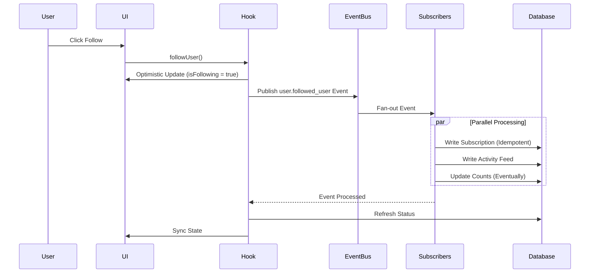

# Event-Driven Follow/Unfollow Architecture

## Overview
This document describes the enterprise-grade, event-driven architecture for follow/unfollow functionality, inspired by Instagram and Google's infrastructure patterns.

## Architecture Principles

### 1. **Event Sourcing**
All follow/unfollow actions are treated as immutable events that are persisted in the event store before being processed.

### 2. **CQRS (Command Query Responsibility Segregation)**
- **Write Model**: Events are published to the event bus
- **Read Model**: Projections (materialized views) for fast queries
- Separation ensures scalability and consistency

### 3. **Idempotency**
Every event processor checks idempotency before processing to ensure exactly-once semantics, preventing duplicate operations.

### 4. **Eventual Consistency**
Count updates and activity feeds are eventually consistent - they don't block the main follow/unfollow flow.

### 5. **Optimistic Updates**
UI updates immediately on user action, then synchronizes with server state for better UX.

## Event Flow



## Components

### Events (src/lib/events/domain/UserEvents.ts)
```typescript
- user.followed_user
- user.unfollowed_user
- user.followed_organization
- user.unfollowed_organization
```

### Event Subscribers (src/lib/events/subscribers/SubscriptionEventSubscriber.ts)

#### 1. **SubscriptionWriteProcessor**
- **Responsibility**: Write to subscriptions table only
- **Idempotency**: Yes
- **Failure Handling**: Throws error (critical path)
- **Pattern**: Upsert with conflict handling

#### 2. **SubscriptionDeleteProcessor**
- **Responsibility**: Delete from subscriptions table
- **Idempotency**: Yes
- **Failure Handling**: Throws error (critical path)

#### 3. **ActivityFeedProcessor**
- **Responsibility**: Write to user_activities for social feed
- **Idempotency**: Yes
- **Failure Handling**: Logs but doesn't throw (non-critical)
- **Pattern**: Fire-and-forget for performance

#### 4. **CountProjectionProcessor**
- **Responsibility**: Update denormalized follower/following counts
- **Idempotency**: Yes
- **Failure Handling**: Logs but doesn't throw (eventually consistent)
- **Pattern**: Eventual consistency

### Hooks

#### useFollowUserEventDriven (src/hooks/useFollowUserEventDriven.ts)
- Publishes events instead of direct DB mutations
- Implements optimistic updates with rollback
- Uses correlation IDs for event tracking
- Refreshes state after event processing

#### useFollowOrganizationEventDriven (src/hooks/useFollowOrganizationEventDriven.ts)
- Same pattern as user follow
- Handles organization-specific logic

## Idempotency Implementation

### EventIdempotency Class
```typescript
class EventIdempotency {
  // Check if event should be processed
  async shouldProcess(eventId: string, processorName: string): Promise<boolean>
  
  // Mark event as complete
  async markComplete(eventId: string, processorName: string): Promise<void>
  
  // Mark event as failed
  async markFailed(eventId: string, processorName: string, error: string): Promise<void>
}
```

### Usage Pattern
```typescript
const shouldProcess = await eventIdempotency.shouldProcess(event.id, 'ProcessorName');
if (!shouldProcess) {
  console.log('Skipping duplicate event');
  return;
}

try {
  // Process event
  await eventIdempotency.markComplete(event.id, 'ProcessorName');
} catch (error) {
  await eventIdempotency.markFailed(event.id, 'ProcessorName', error.message);
  throw error;
}
```

## Benefits

### 1. **Scalability**
- Subscribers can be scaled independently
- Event bus handles load distribution
- Non-blocking operations for non-critical paths

### 2. **Reliability**
- Idempotency prevents duplicate operations
- Event sourcing provides audit trail
- Dead letter queue for failed events

### 3. **Maintainability**
- Single Responsibility Principle per subscriber
- Easy to add new features (new subscribers)
- Clear separation of concerns

### 4. **Performance**
- Optimistic UI updates for instant feedback
- Eventual consistency for non-critical updates
- Parallel processing of independent operations

### 5. **Observability**
- All events logged with correlation IDs
- Easy to trace event flow
- Event store provides complete history

## Migration from Old System

### Old Architecture Issues
1. ❌ Direct database mutations in edge functions
2. ❌ Blocking database triggers for count updates
3. ❌ No audit trail for follow/unfollow actions
4. ❌ Tight coupling between validation and mutation
5. ❌ Race conditions on rapid follow/unfollow

### New Architecture Solutions
1. ✅ Event-driven with immutable event log
2. ✅ Asynchronous count updates (eventually consistent)
3. ✅ Complete audit trail in event store
4. ✅ Loose coupling via event bus
5. ✅ Idempotency prevents race conditions

## Future Enhancements

### Phase 2: CQRS Read Models
- Create `user_follow_projection` materialized view
- Optimize read queries with denormalized data
- Remove database triggers

### Phase 3: Real-time Sync
- Subscribe to Supabase real-time changes
- Sync UI with server state automatically
- Handle concurrent updates gracefully

### Phase 4: Fan-Out Architecture
- Implement activity feed fan-out on write
- Pre-compute timelines for followers
- Cache frequently accessed follow lists

### Phase 5: Saga Pattern
- Orchestrate complex multi-step flows
- Implement compensation logic for failures
- Support distributed transactions

## Testing Strategy

### Unit Tests
- Event factory functions
- Event subscribers (idempotency)
- Hook optimistic updates

### Integration Tests
- End-to-end follow/unfollow flow
- Idempotency under concurrent requests
- Rollback on errors

### Load Tests
- Concurrent follow/unfollow operations
- Event bus throughput
- Subscriber processing latency

## Monitoring & Observability

### Metrics to Track
- Event publishing latency
- Subscriber processing time
- Idempotency cache hit rate
- Failed events in dead letter queue
- Count projection lag (eventual consistency delay)

### Alerts
- Event processing failures
- Dead letter queue size threshold
- Subscriber processing timeout
- Idempotency cache errors

## References

### Industry Patterns
- **Instagram**: Social graph with fan-out architecture
- **Google**: Event sourcing for Gmail and Google Drive
- **Twitter**: Timeline fan-out and eventual consistency
- **Netflix**: Event-driven microservices

### Internal Documentation
- `src/lib/events/README.md` - Event system overview
- `ENTERPRISE_API_GUIDE.md` - API patterns and best practices
- `SECURITY_ARCHITECTURE_FIX.md` - Security considerations
